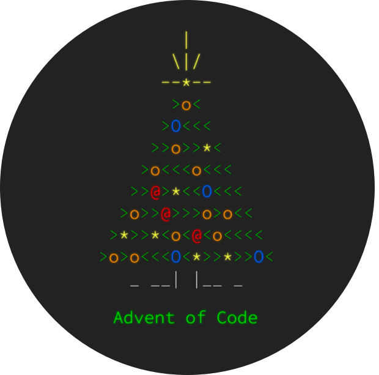

> My Advent of Code 2025 solutions.

 

    <!--~ Technologies ~-->
    
    
    
    <!--~ Repository CI/CD ~-->
    
    
    <!-- Standards -->
        
    
    
    <!-- Open issues and PRs -->
    
    
    <!--~ Repository Statistics ~-->
    
    
    
    
    
       
    
    <!--~ Repository Updates ~-->
    
    
       

 

# Advent of Code (2025)

Advent of Code is an Advent calendar of small programming puzzles for a variety of skill levels that can be solved in any programming language you like. People use them as interview prep, company training, university coursework, practice problems, a speed contest, or to challenge each other. If you'd like to support Advent of Code, you can do so indirectly by helping to share it with others or directly via AoC++.

 

  

    
  

 

Just like last year, I will be doing it in Rust. Rust is a fast, memory-safe, and productive programming language that can run on embedded devices, web services, and more.

## Credits

- Tygo van den Hurk \<[@Tygo-van-den-Hurk](https://redirects.tygo.van.den.hurk.dev/github/personal/)>

To see how to start or develop see [CONTRIBUTING.md](./CONTRIBUTING.md).

## Licence

All files in this repository fall under a [LICENCE](./LICENCE).
